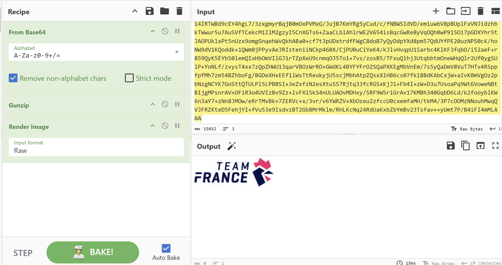
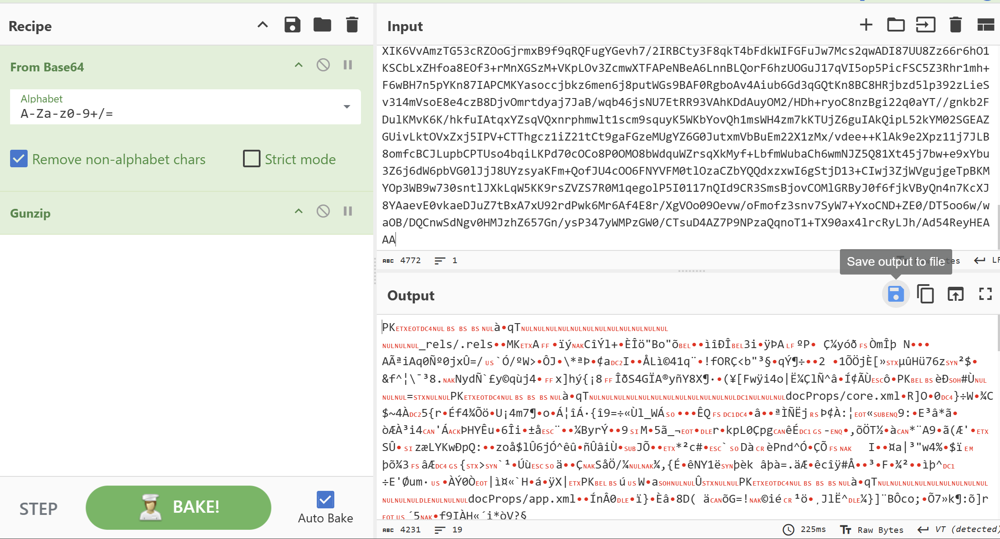
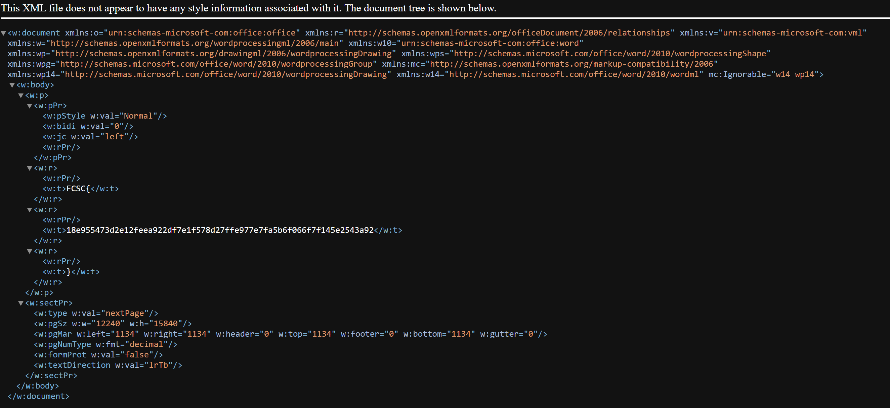

# Solution

for the challenge found at: https://hackropole.fr/fr/challenges/forensics/fcsc2022-forensics-a-l-ancienne/
with the hint: "You need to retrieve and analyze the data exchanged in this capture. We prefer to warn, before panicking, you will have to relax and decompress to do this calmly."
---
## Here is my solution:

### Analysis:
after downloading the capture, we open it in WireShark. We find a few ICMP and many DNS requests between 2 devices back and forth. 

the ICMP is not interesting, it doesn't contain much data
However, the DNS seems a transmission of data (maybe files).

### random testing
I gave DeepSeek AI model the header of the file, and it was able to detect that `cGFzc3dk` at the end the first few lines is the base64 for "passwd". Also, ChatGPT suggested that it looks like it is gzip encoded as well because of the `+H4s`.

Here I went to deep into that rabit whole despite that it was a good start, and failed many times to decrypt them through multiple python scripts, as I was trying to Gunzip line by line, instead of file by file. 

### data extraction
I knew at this point that I need to extract data from those packets all together at once. I found online that I can use `tshark` to acheive that fast. After some testing, I was able to reach this command:
`tshark -r cap -T fields -e dns.qry.name -Y "dns && ip.src == 172.16.76.135" > queries.txt`

This command provided me with 909 lines of extracted data only from the dns protocol. using the hint found above about 'passwd', I was able to know which lines among those 909 belong to the passwd file.

I isolated them, and manually:
1. replaced '*' with '+', 
2. removed all '-.', and 
3. removed the 'cGFzc3dk' from the end of each line.

after that, I had to remove new character symbol from each line with the following script: 
```python
    with open("passwd", "r") as infile, open("passwd_single_line.txt", "w") as outfile:
    single_line = "".join(line.strip() for line in infile)
    outfile.write(single_line)
```

finally, I took that output, and pasted it in CyberChef with conversion From Base64, with Gunzip action as follows:


### repeating same flow for other files

I repeated the same actions to some of the other files that were encrypted in the same way. Some of them were images like file2 below:




and the flag was inside `file4` inside a word document. We need to install the output from CyberChef to a file:




and then unzip it, and navigate to document.xml file:



Giving the flag as:
`FCSC{18e955473d2e12feea922df7e1f578d27ffe977e7fa5b6f066f7f145e2543a92}`